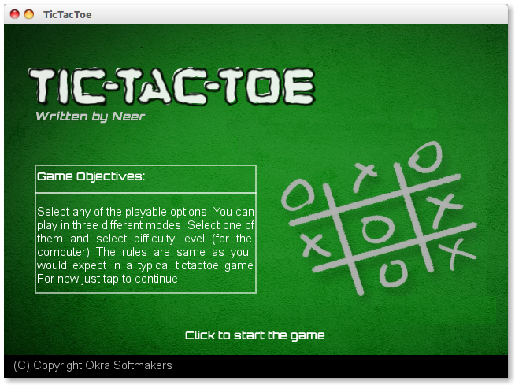

# TicTacToe (with unbeatable AI)

A tictactoe game with multiple modes of playing (human-human, human-computer, computer-computer)!
And if I didn't say this before then *the AI is unbeatable*!!

See the screenshots for yourselves

 
  A look of the game (<i>For more see <a href="screenshots">screenshots</a></i>)

## How to run? 🏁
You will need a special framework called [LOVE2D](https://love2d.org) (don't worry it's free)

## Credits for Graphics
Pixels.com
## Credits for Sound
http://freesound.org/people/joshuaempyre/sounds/251461/
(Music)
Other Sounds were generated using a software called Bfxr (and thanks to Colton for that)

## License

It is licensed under MIT. So do whatever you like!

## Known bugs

There are some known bugs related to rendering (when you enable AI
